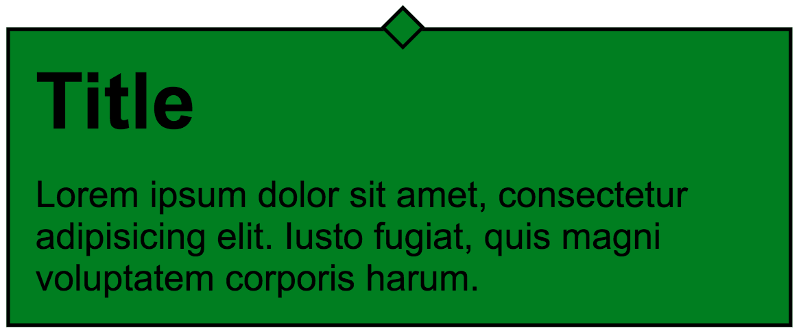

# Important information

Read the following guidelines before doing the exercises.

## How do you begin?

1. [*Fork*](https://guides.github.com/activities/forking/) the repository containing exercises.
2. Clone the repository onto your computer using the command: `git clone repository_address`.
   You will find the address of the repository by pressing "Clone or download" button on its webpage.
3. Complete the exercises and commit changes to your repository using the commands below.
   `git add filename` will add a single file which you have changed.
   If you want to add all the changed files at once, use `git add .`.
   Remember that the fullstop (dot) at the end of this command is important!
   Next, commit changes using `git commit -m "description_of_changes"`.
4. Push changes to your repository on GitHub by typing: `git push origin main`.
5. Create a [*pull request*](https://help.github.com/articles/creating-a-pull-request) to the original repository when you have finished all the exercises.

### Do the exercises in appropriate files.

**The repository with the exercises will be removed 2 weeks after the end of the course. This will result in the removal of all forks made from this repository.**


## Task 1

> ### Preparation
> Modify the `package.json` so that the `source` variable points to:
> - `01_Task_1`
>
> **Remember to interrupt Parcel (`CTRL+C`) after each change in the `package.json` and then turn it back on (`npm start`).**

Section `.centered-text` contains a `p` element. Set its width to `100px`. Center it vertically and horizontally in the middle of the section. The text should be three times the size of the basic value (use the `rem` unit).

Section:
- should have the background color: `#FFDA69`, stored in the variable `gold`,
- width `100%`,
- height `100%`.

Also attach the "India Flower" font with the thickness of `400` from Google Fonts and apply it throughout the document. Additionally, add a basic reset.


## Task 2

> ### Preparation
> Modify the `package.json` so that the `source` variable points to:
> - `02_Task_2`
>
> **Remember to interrupt Parcel (`CTRL+C`) after each change in the `package.json` and then turn it back on (`npm start`).**


Define three colors in Sass using variables:

* the first variable named ```baseColor``` - set its color to ```#2325b8```,
* the second variable called ```secondColor``` - color lighter than the base by **30%**,
* the third variable named ```thirdColor``` - color darker than the base by **40%**.

Then set these colors as the border colors (`5px solid`) of these subsequent sections:

- `section-1` - baseColor,
- `section-2` - secondColor,
- `section-3` - thirdColor.


## Exercise 3

> ### Preparation
> Modify the `package.json` so that the `source` variable points to:
> - `03_Task_3`
>
> **Remember to interrupt Parcel (`CTRL+C`) after each change in the `package.json` and then turn it back on (`npm start`).**


Create a mixin named `dialogBox` which takes two arguments - color (`$backgroundColor`) and box width (`$width`).

Its task is to set the following styles:

* width: `$width`.
* internal distance: `10px`
* background: `$backgroundColor`
* border with a thickness of `1px` and black color
* margin of `40px` on top and bottom, automatic on the sides

Add a pseudo-element **:after** to the mixin, which will create a square with the dimensions: `10px` by `10px`, that will decorate the box. Run the mixin in the `dialog` class.

The final design should look like this:




## Task 4

> ### Preparation
> Modify the `package.json` so that the `source` variable points to:
> - `04_Task_4`
>
> **Remember to interrupt Parcel (`CTRL+C`) after each change in the `package.json` and then turn it back on (`npm start`).**


Use Sass to define a map named `colors` which will have **12 key-value pairs** and each value will correspond to a different color. Use the colors listed below (importantly, let the color names and values be **exactly as in the example below**):

- Royal blue - `#0A2463`
- Red Salsa - `#FB3640`
- Granite gray - `#605F5E`
- CG blue - `#247BA0`
- Key lime - `#EAF27C`
- Dark purple - `#370031`
- Brick red - `#CE4760`
- Cadmium orange - `#F28F3B`
- Steel Teal - `#588B8B`
- Bluetiful - `#446DF6`
- Peach - `#FECDAA`
- Olive Drab - `#392A16`


Then, using Sass, create **all** classes necessary for Grid (`container`, `row`, columns). The grid should have **12-column** layout. The container should be up to `990px` wide, maximum. All elements should also have the correct `box-sizing`.

In HTML, create a structure of 12 columns in a row and then give each column **other color** using the map prepared earlier. **Don't create additional classes for the colors!**

Columns in Grid, up to the screen width of `600px`, should be arranged underneath each other and have `50px` height each. Above `600px` they should have `300px` height.


### Example

#### Up to 600px


#### Over 600px


## Task 5

> ### Preparation
> Modify the `package.json` so that the `source` variable points to:
> - `05_Task_5`
>
> **Remember to interrupt Parcel (`CTRL+C`) after each change in the `package.json` and then turn it back on (`npm start`).**


Element `.movie` contains an embedded YouTube video. Make sure that this video is appropriately scaled on **all** devices! It should fill the entire screen width.

However, above `1024px` it should stop scaling further and remain in such width and proportions. Additionally, it should be located in the middle of the screen.
